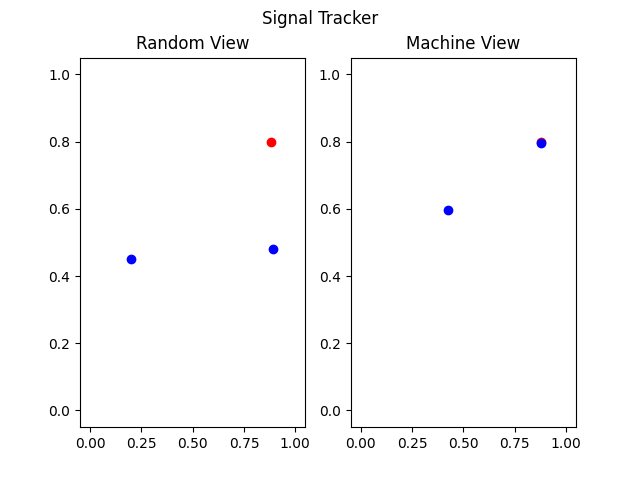

# Signal Tracker



## Overview

The **Signal Tracker** project simulates the movement of two targets towards a randomly generated goal in a 2D space. The targets update their positions based on their distance to the goal, showcasing a simple implementation of tracking algorithms.

## Features

- Randomly generated goal position.
- Two targets that move towards the goal.
- Visualization of both the targeting and random movements.
- Real-time updates of positions using Matplotlib.

## Installation

```bash
pip install -r requirements.txt
```

## Usage

To run the **Signal Tracker** simulation, follow these steps:

1. **Run the Simulation**: Execute the following command in your terminal:
   ```bash
   python Track_Stop.py
   ```
